# AWS-Connect
An AWS-connect introduction project to create a small scale contact center for a client.

# Purpose

This project is designed to create a contact center for the company KWGlobal. The contact center is for its consulting, customer analysis( vanity number creation) and customer service purposes. The steps used to create this contact center are the following:

- Create AWS connect instance
- Configure AWS connect users
- Configure the routing
- Lambda and DynamoDB integration
- Quality and reporting

## Tools used

- AWS connect
- AWS Lambda
- AWS S3
- AWS DynamoDB
- AWS IAM
- Node.js

## AWS connect address
[https://kwglobal.my.connect.aws/]

## Development

- Create AWS connect instance

I used the false company name KWGlobal to set up the AWS connection. This company provides international trading consulting services.  During the creation process, I did not set up an administrator, since I would log on to the Amazon Connect service to manage the instance. By default, both incoming and outgoing calls were allowed. All recordings and reports of the calls would be stored in the S3 bucket below, and the contact flow logs would be stored in Amazon CloudWatch.

Connect data

S3 bucket

amazon-connect-xxxxxxxxxxxx/connect/KWGlobal

Contact flow logs

/aws/connect/KWGlobal

After the instance has been created, the phone number then be claimed in the contact control panel.

The phone number I choice was +1 302-985-6970

I used my phone calling my contact center, the call went through and please see the GIF below.

---

- Configure AWS connect users

Users in amazon connect are including agents, supervisors, QA personnel and administrators. The security profiles will be assigned to users for specific permissions. Assigning an agent to a hierarchy enables me to report on groups and groups of groups within the reporting system. Also, an agent can only be assigned to a single routing profile, which determines what types of calls the agent can receive and the queue priority.

My first step was to create an agent hierarchy.

The level 1 represents the client company (KWGlobal), my level 2 represents two departments within the company (the consulting department and customer service department). The level 3 will be the region (the consulting department is located in Shanghai, while the customer service department is located in Portland), the level 4 will be the two cities, and the level 5 will be the supervisor.

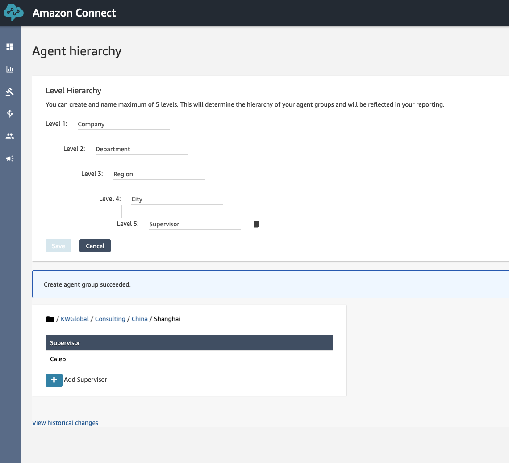

Second, I created users for this AWS connect contact center.

The first one is Caleb Wang ( admin)
He was given the basic routing profile for now, and the admin security profile.

The second user is Jimin Lee (callcenter manager)
She was given the basic routing profile for now as well, and the callcentermanager security profile.

The third user is Peter Parker (agent)
Hes was given the basic routing profile , and the agent security profile.

The forth user is Mary Jane (agent)
She was given the basic routing profile, and the agent security profile as well.

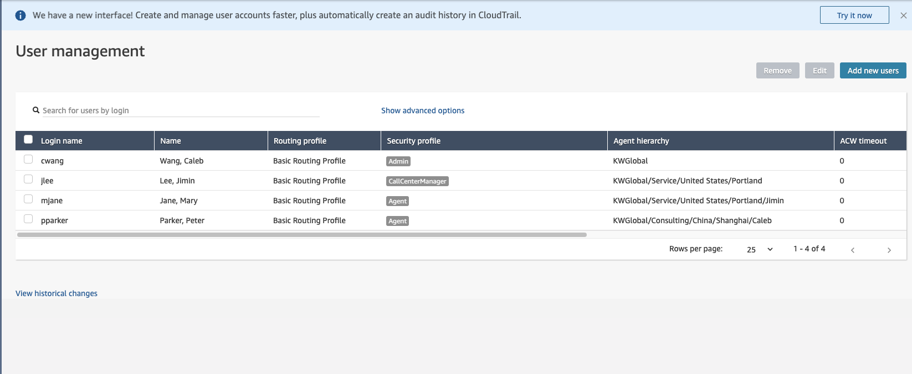

After the users were created, three more agent status were added to cover all situation.

Lunch- when agents go on lunch
Break- when agents go on breaks
Meeting- when agents/managers are in meetings

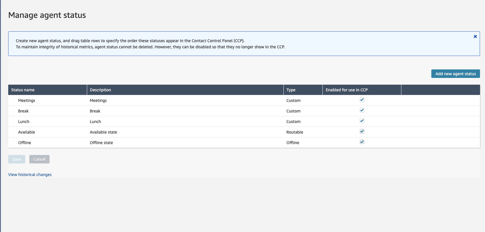

---

- Configure the routing

Routing profiles contain one or more queues, and set the priority. Queues are used to group contact types together, and should have the operation hours configured. Also, quick connects, think speed dials are created and assigned to queues.  Queues then have a phone number configured which is then used as the calling line identity for callbacks.  Then the contact flows can be designed and created include prompts, queues, and many other action blocks.

First step, I created the company’s hours of operation for both the consulting and customer service hours:

Monday through Friday, from 9 am to 6 pm
Saturday from 9 am to 3 pm.

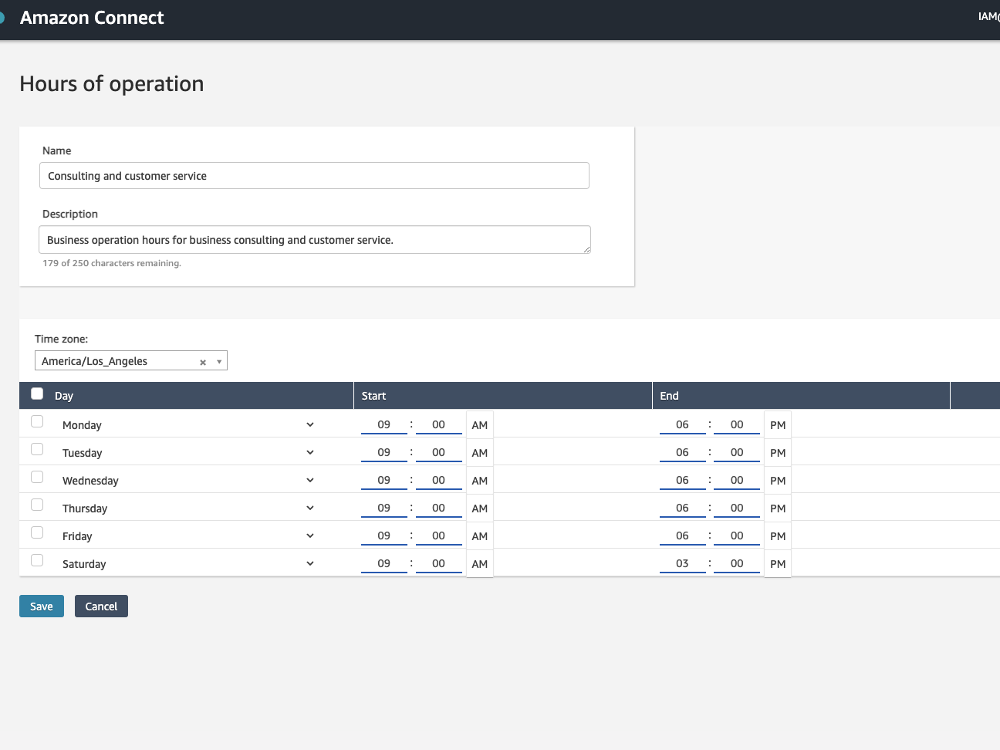

Second, the queues need to be created.

The first queue I created was for Customer Service.  For the hours of operation, I set it with the operation hours I just created. The Outbound caller ID name was set as the company name KWGlobal, and the outbound caller ID number was the soft number created by the connect service. For the Outbound whisper flow, I set it with default outbound for now, and leave limit and quick connects unchecked for now.  For the quick connects options, I added consulting, higher management, and direct agent Mary. (the quick connects options were created during the next step)

The second queue I created was for Business Consulting.  For the hours of operation, I set it with the operation hours I just created. The Outbound caller ID name was also set as the company name KWGlobal, and the outbound caller ID number was the soft number created by the connect service. For the Outbound whisper flow, I set it with default outbound for now, and leave limit and quick connects unchecked for now. For the quick connects, I added customer service, higher management, and direct agent Mary.

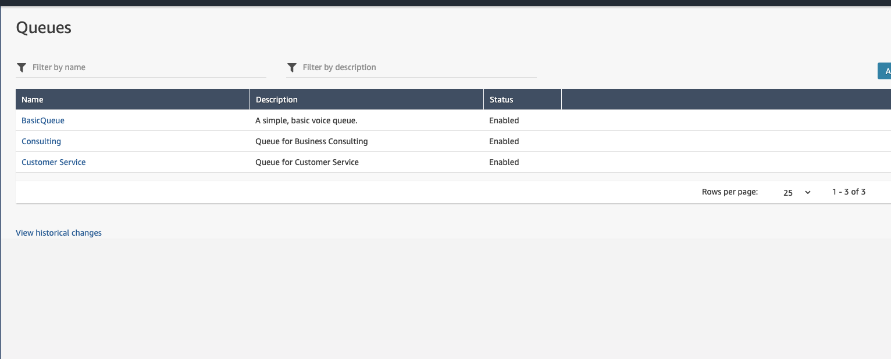

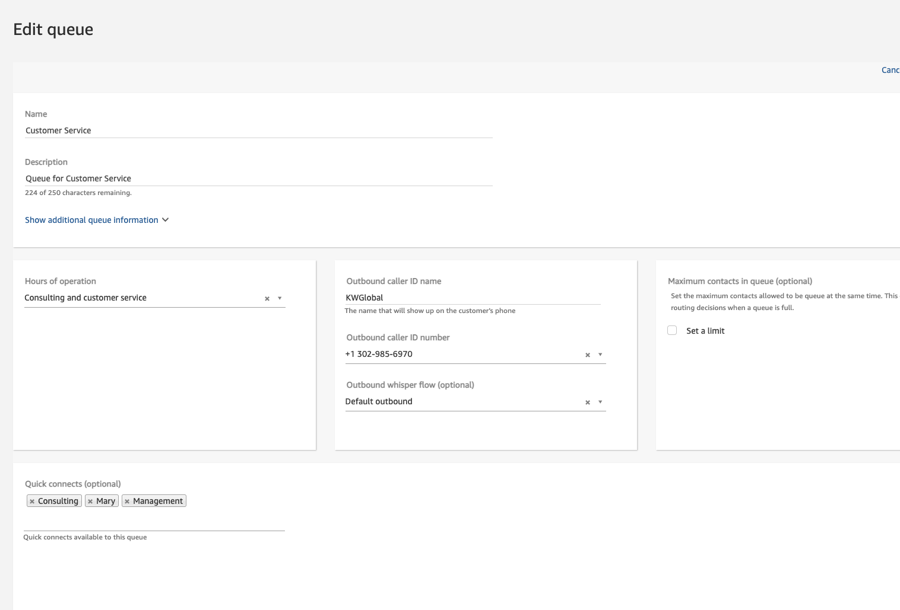

Third, I created some quick connects options

The first quick connect created was management, its an external type with the US phone number.
The second quick connect created was the consulting department, the type was queue and the destination was consulting queue.  The contact flow was set as the default queue transfer.
The third quick connect created was the customer service department, the type was queue and the destination was customer service queue.  The contact flow was also set as the default queue transfer.
The forth quick connect created was for the agent Mary Jane, the type was agent, and the destination was directly to her. The contact flow was also set as the default queue transfer.

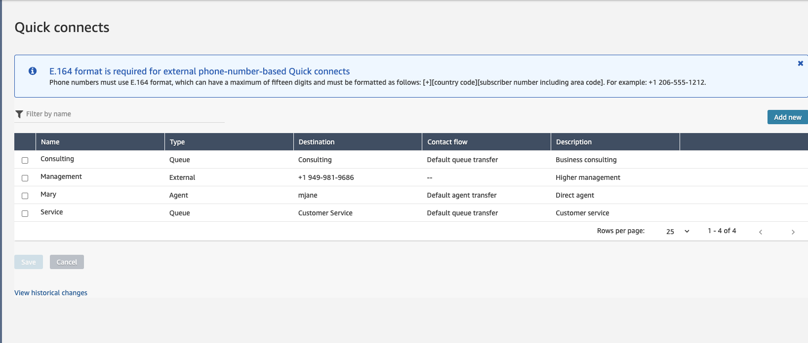

Forth, created routine profile.

Two routine profiles were created, one for business consulting, and one for customer service.

For the customer service routing profile, voice was set as channel and concurrency, the customer service queue was added as the routing profile queue, and the customer service queue was also set for the default outbound queue.

For the business consulting routing profile, voice was set as channel and concurrency, both the consulting queue and service queue were added, with consulting queue set to priority 1, and customer service queue set to priority 2. So the consulting calls would be handled first, and once there were no more consulting calls, the service calls would be handled. For this purpose, the delay for the service queue was set for 15 seconds.

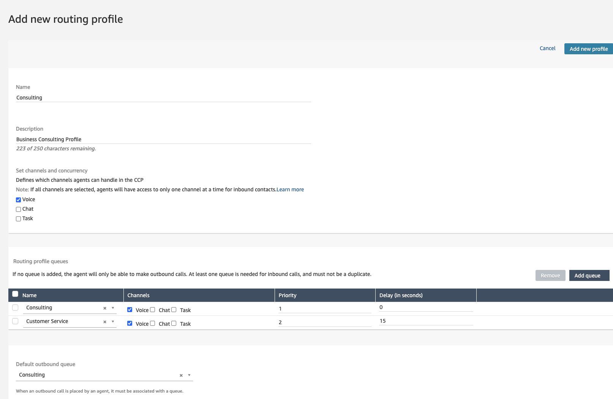

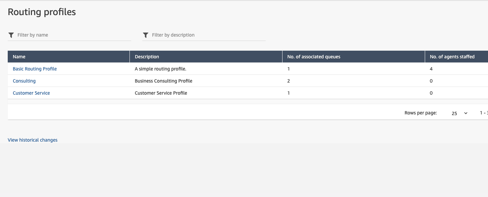

Fifth, after the routine profiles were created, assigned them to the users.

Under Mary Jane, the basic routing profile was changed with customer service. And under Parker, the basic routing profile was exchanged with Consulting routing profile.

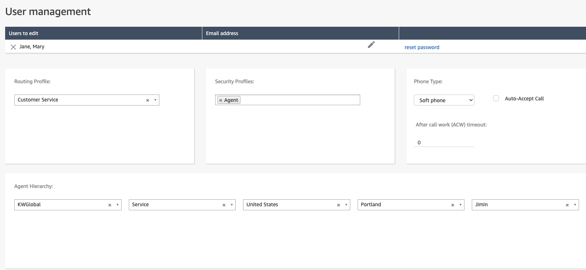

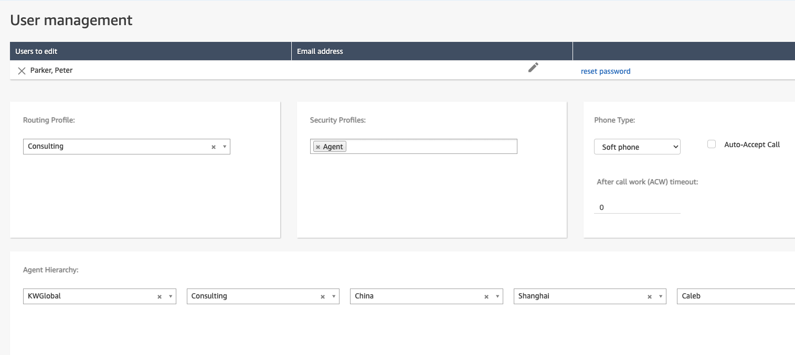

Sixth, created the IVR contact flow

The name of the contact flow is KWGlobal Main Menu, which serves as the main menu for KWGlobal’s contact center.

From the entry point, the first action block added was 'play prompt'. Since I didn't have the prompt library setup, so I set the text-to-speech or chat text option with the welcome message:” Welcome to KWGlobal”. After the prompt, the next action block added was ‘Get customer input’, which created a menu for customer to choose.  The text-to-speech prompt of “ Your calls are important to us, please press 1 for customer service or 2 for business consulting” were set for the menu options. Under add condition, I added option 1 and option 2 corresponding to the two options.

From the ‘Get customer input’ action block, next action blocks were the two working queues.  The first working queue’s output was set to the Customer service queue, the second working queue’s output was set to the consulting queue.  After the working queues were set, I then added the action block” Check hours of operation”

After adding the ‘Check hours of operation’, I added following action blocks:

Transfer to queue

Play prompt(for error): with voice prompt ’Sorry, there have been a system error, please try again later. ‘

Play prompt(for business closed):with voice prompt ’Sorry, we are currently closed. Our normal business hours are Monday to Friday 9 am to 6 pm, and Saturday 9 am to 3 pm. Please call back between the business hours. Goodbye’

The detail block connections and block arrangement are showing below.

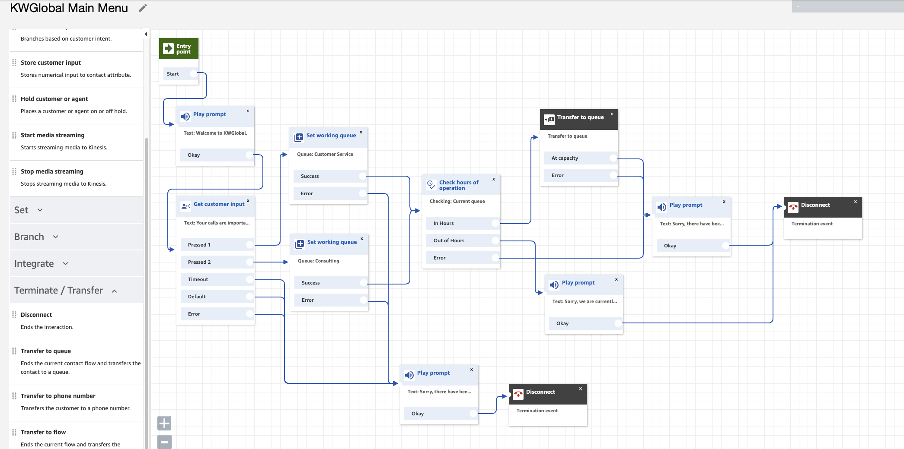

After the main menu was built, then I set a Call back in queue contact flow to prompt the caller the option to request a call back after 2 minutes. This customer queue flow was set to the name KWGlobal callback in queue. The first action block from the entry point was the 'looped prompts' block, with the prompt of “ All of our agents are currently assisting others customers. Your call is very important to us. Please stay on the line for the next available agent. “  after the prompts setup, the audio recording of pop music was selected to play during the caller wait time.  After the loop prompts action block, the ‘Get customer input” block was added, with the text-to-speech prompt” We apologize for the delay. If you would like to receive a callback from us, please press 1. “ the option of “1” was also added in this block.  Then, “set callback number” block was added for caller to press 1 for a callback request. Inside this block, I set use attribute type to system, and attribute to Customer Number.  if the callback number would be successful saved, then a new 'play prompt' block was added with the text-to-speech prompt “ Thank you for calling KWGlobal. You will receive a call back shortly. Goodbye. “ after the Play prompt block, the 'Transfer to queue' block was added with the option of “transfer to callback queue”.  In the end, the 'Disconnect' block was added after a success transfer to callback queue.

For error handling, the following blocks were also added:

Play prompt(remain in line): with text-to-speech prompt “ you will remain in line for next available agent”
Play prompt(invalid callback number): with text-to-speech prompt “ Sorry, your number is not valid, you will remain in line”
Play prompt(error ): with text-to-speech prompt “ Sorry there has been a system error, you will remain in line”
End flow/Resume: for caller to be remain in the line.

For detail block arrangement and contact flow, please see the diagram below:

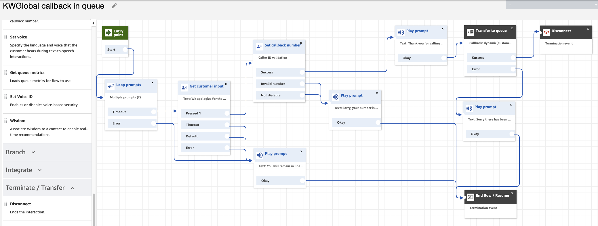

Then the callback queue flow could be added to the main menu with “Set customer queue flow” action block. Under customer queue flow, chose the callback in queue flow. Please see the KWGlobal Main Menu contact flow as the diagram below:

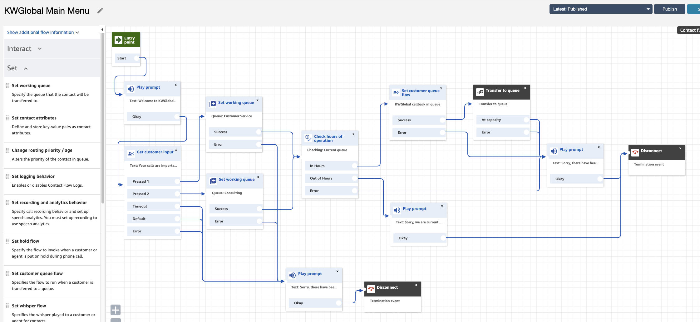

Seventh, set the routing phone numbers. Under the phone number, I set the contact flow/IVR to the KWGlobal Main Menu. The contact flow was published and worked with right actions.

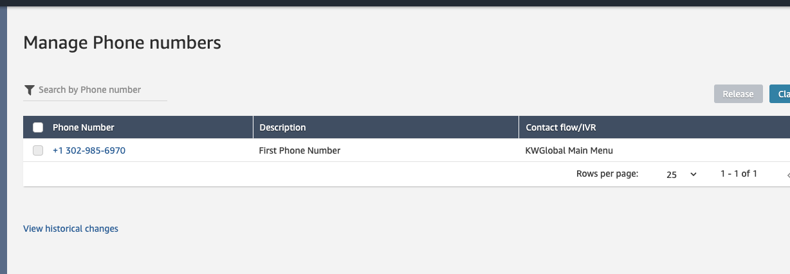

---

- Step 4: Lambda and DynamnoDB integration

First, I created a dynamoDB table to store caller info.

The table’s name is cus-phone-vanity-number.

And for the table’s items, I added
phone(string);
companyName(string);
vanityNumber(string);

Second, created an role in IAM for the lambda function to have read and write access to this DynamoDB table

Created a role name: Lambda-DynamoDB
Policy: AWSLambdaBasicExecutionRole

Then added inline policy to the role, to give read/write access to the DynamoDB function.
Under resource, the ARN of the newly created DynamoDB table was added here. So the Lambda function would have access to this particular table

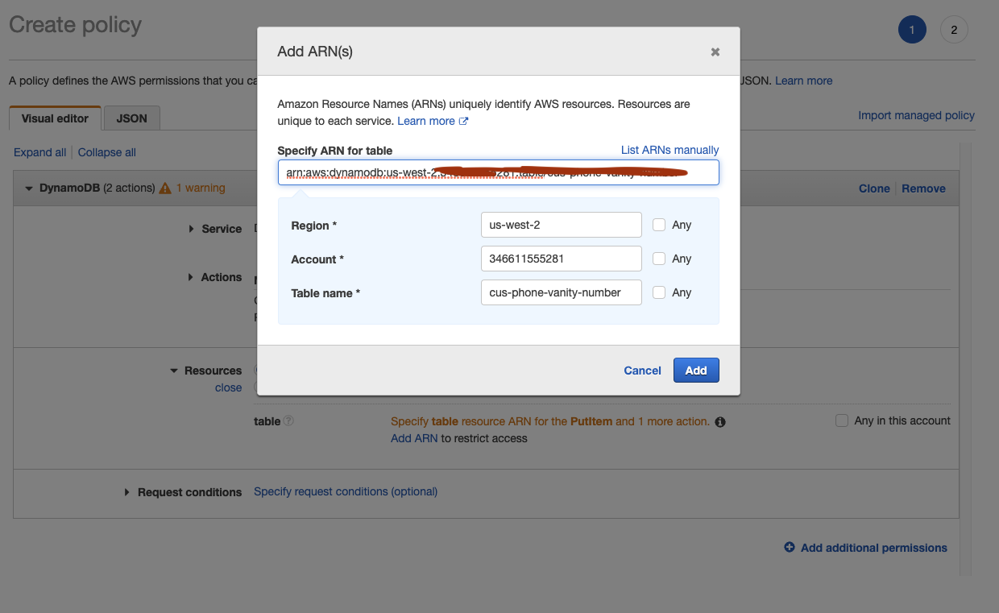

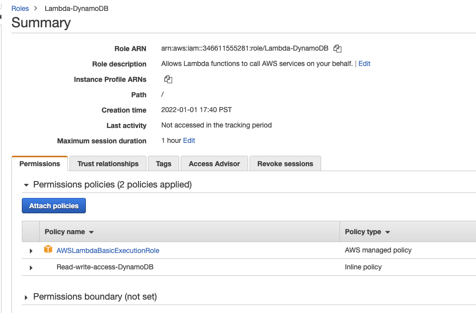

Third, created the Lambda function.

First of all, I created the function to convert a phone number to vanity number based on company's name (for best vanity number option), then to record the result on the DynamoDB table. Based on the vanity number converting rules, if the phone number last 7 digits could not be convert to letter closed to its company name, then random letter would be converted instead.

The function name is recordVanityNumber, which was assigned to the role of read/write to the DynamoDB table.

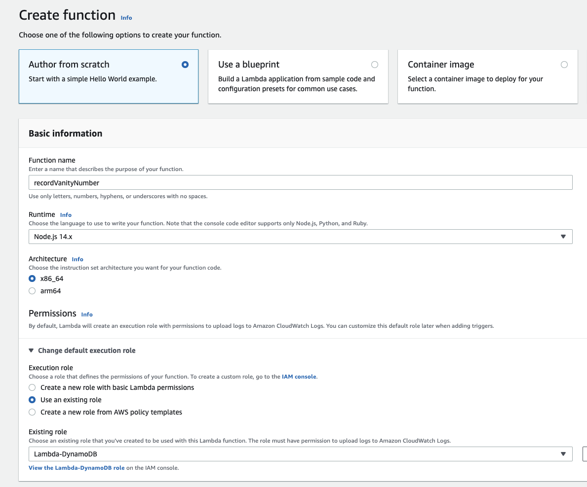

For the function, the client's phone number, company name were given as string. The vanity number would be created by the lambda function. And all three key/value pairs would be recorded to the DynamoDB table. The funtion would check the last 7 digits of the phone number against the company name first for BEST vanity number option. If the condition is not met, then random letter would be assigned to create the vanity number. After the function is created, the test event was created and the test was successful. The DynamoDB table successfully recorded the new entry and newly created vanity number.

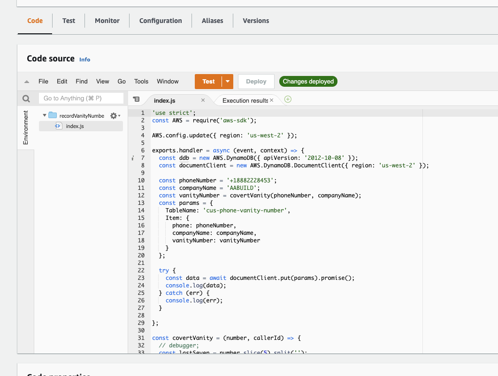

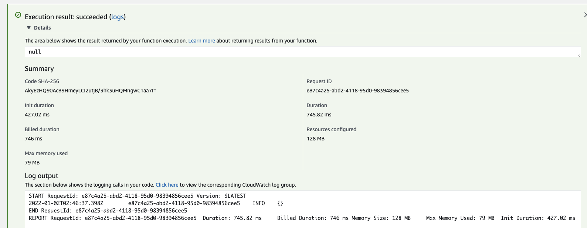

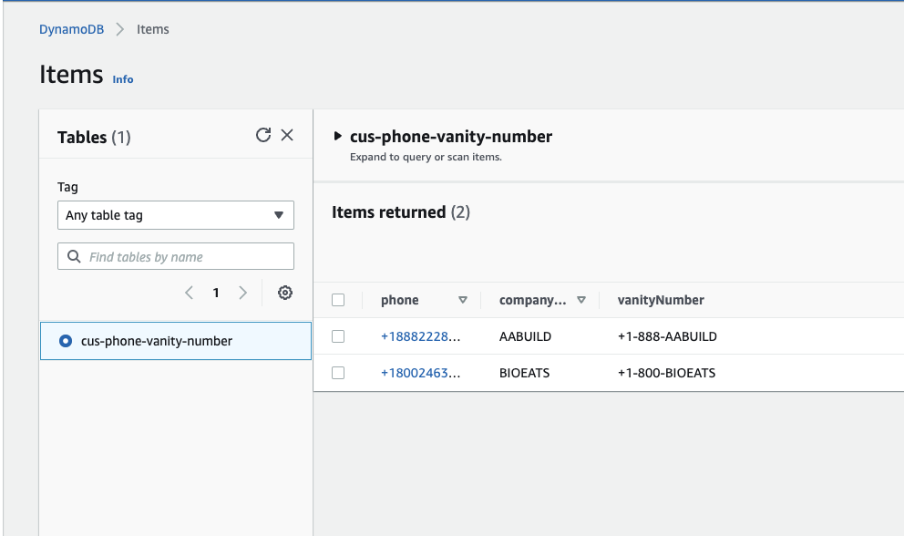

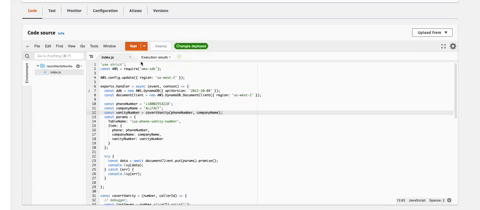

Please see the Github repo for the function detail. The five best vanity numbers were recorded and were shown below:

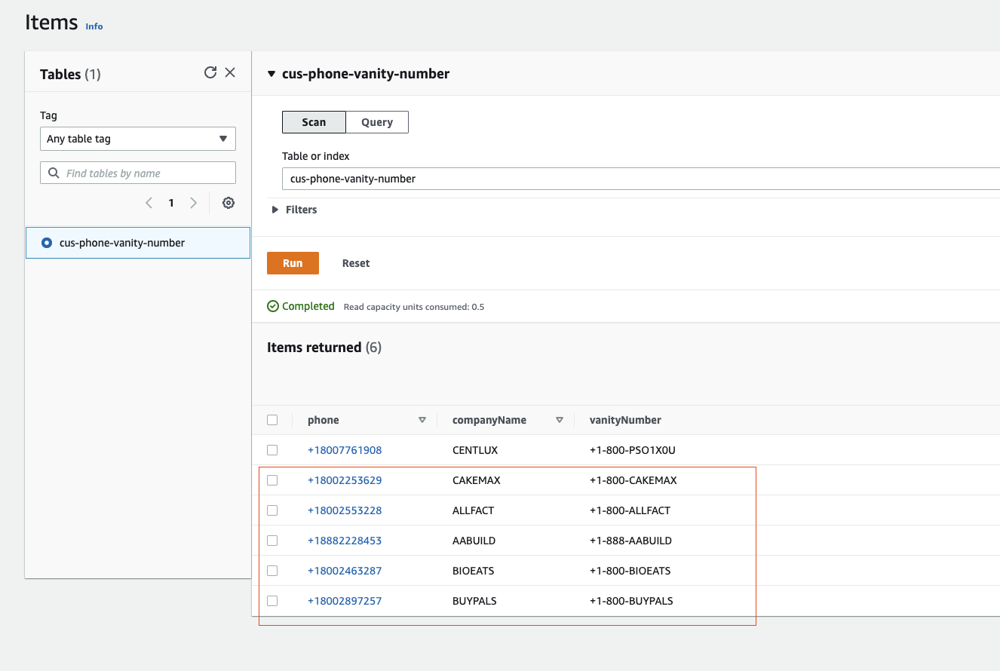
