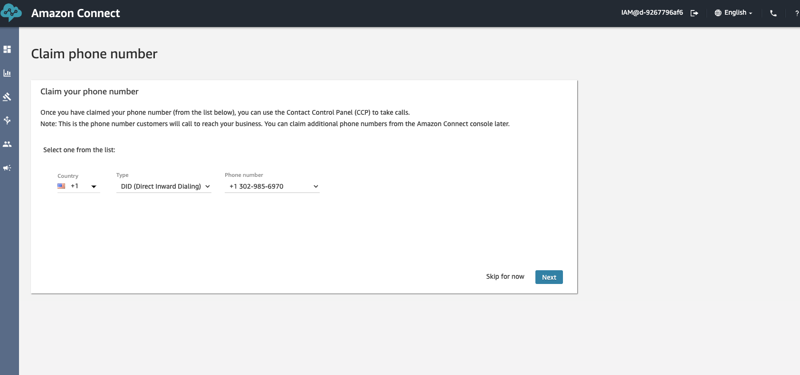

# AWS-Connect
An AWS-connect introduction project to create a small scale contact center for a client.

# Purpose

This project is designed to create a contact center for the company KWGlobal. The contact center is for its consulting, customer analysis( vanity number creation) and customer service purposes. The steps used to create this contact center are the following:

- Create AWS connect instance
- Configure AWS connect users
- Configure the routing
- Lambda and DynamoDB integration
- Quality and reporting

## Tools used

- AWS connect
- AWS Lambda
- AWS S3
- AWS DynamoDB
- AWS IAM
- Node.js

## AWS connect address
[https://kwglobal.my.connect.aws/]

## Development

- Create AWS connect instance

I used the false company name KWGlobal to set up the AWS connection. This company provides international trading consulting services.  During the creation process, I did not set up an administrator, since I would log on to the Amazon Connect service to manage the instance. By default, both incoming and outgoing calls were allowed. All recordings and reports of the calls would be stored in the S3 bucket below, and the contact flow logs would be stored in Amazon CloudWatch.

Connect data

S3 bucket

amazon-connect-xxxxxxxxxxxx/connect/KWGlobal

Contact flow logs

/aws/connect/KWGlobal

After the instance has been created, the phone number then be claimed in the contact control panel.

The phone number I choice was +1 302-985-6970

I used my phone calling my contact center, the call went through and please see the GIF below.

---

- Configure AWS connect users

Users in amazon connect are including agents, supervisors, QA personnel and administrators. The security profiles will be assigned to users for specific permissions. Assigning an agent to a hierarchy enables me to report on groups and groups of groups within the reporting system. Also, an agent can only be assigned to a single routing profile, which determines what types of calls the agent can receive and the queue priority.
